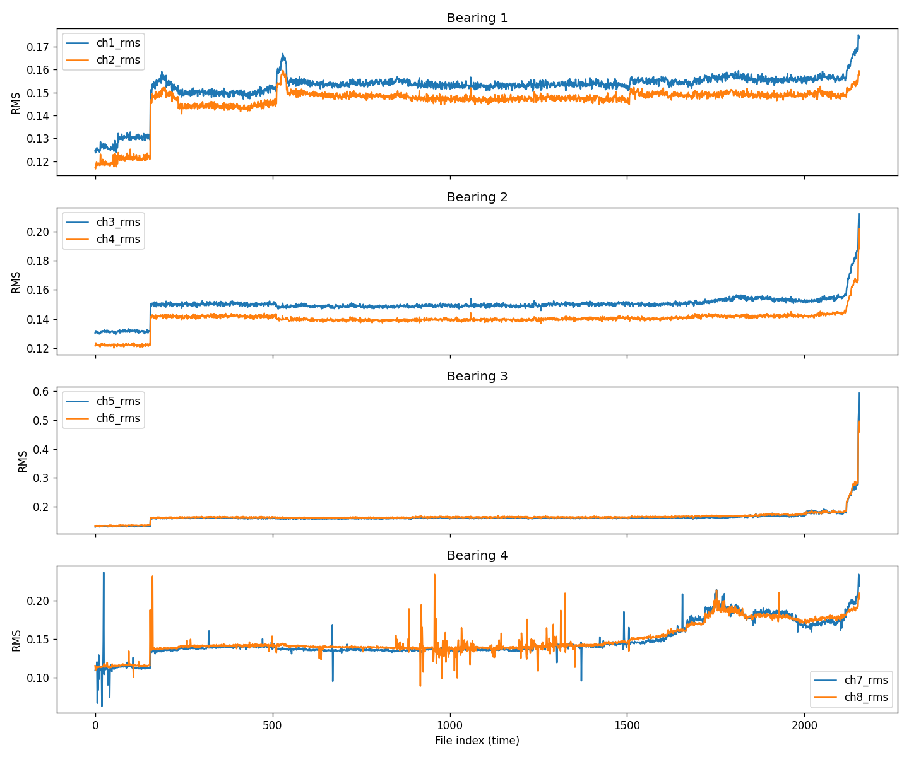
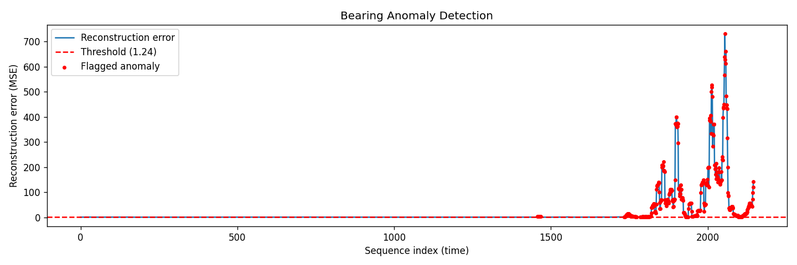

# Bearing Anomaly Detection

Unsupervised anomaly detection for rotating machinery bearings using an LSTM Autoencoder, trained on the NASA IMS Bearing dataset (test-to-failure vibration data).

## Overview

Rather than relying on labeled failure data (rarely available in practice), this project learns what *normal* bearing vibration looks like and automatically flags deviations — a realistic predictive maintenance setup where failures are unlabeled and rare.

**Pipeline:** raw vibration signals → statistical feature extraction → LSTM Autoencoder trained on healthy data only → reconstruction-error-based anomaly scoring → persistence filtering to suppress transient noise.

## Dataset

[NASA IMS Bearing Dataset](https://www.kaggle.com/datasets/vinayak123tyagi/bearing-dataset) — 2,156 vibration snapshots (8 channels, 20,480 samples each, 1-second recordings every 10 minutes) covering four bearings from healthy operation through failure. In this run, bearing 3 developed an inner race defect and bearing 4 a roller element defect.

## Approach

1. **Feature extraction** (`data_loader.py`) — per channel, per snapshot: RMS, kurtosis, peak amplitude, crest factor (32 features total).
2. **Preprocessing** (`prepare_dataset.py`) — StandardScaler fit on the healthy portion only; features windowed into overlapping sequences (length 10) for the LSTM.
3. **Model** (`model.py`) — LSTM Autoencoder: encodes each sequence to a latent vector, then reconstructs it. Trained only on healthy sequences, so it learns to reconstruct normal patterns well and struggles on abnormal ones.
4. **Training** (`train.py`) — 50 epochs on an RTX 3090; training loss dropped from 0.80 to 0.45.
5. **Anomaly detection** (`detect_anomalies.py`) — threshold set at `mean + 3×std` of reconstruction error on healthy data; a persistence filter requires 5+ consecutive sequences above threshold before flagging, to suppress single-frame noise spikes.

## Results

**Degradation is visible directly in the extracted features** — RMS trend for all four bearings, confirming bearing 3 and 4 failures:



**The model detects it automatically**, with no failure labels used during training. Reconstruction error stays flat and near-zero for the healthy region, then rises sharply and sustained right where the RMS trend shows real degradation beginning:



The model flags a brief early transient around sequence ~1460, then sustained anomalous behavior from sequence ~1750 onward — matching the visually confirmed onset of degradation in bearings 3 and 4.

## Project structure

```src/
data_loader.py # raw signal -> statistical features
plot_features.py # RMS trend visualization
prepare_dataset.py # train/test split, scaling, sequence windowing
model.py # LSTM Autoencoder architecture
train.py # training loop
evaluate.py # reconstruction error over time
detect_anomalies.py # thresholding + persistence-filtered anomaly flags
assets/ # result plots used in this README
```


## Running it

```bash
pip install torch torchvision torchaudio numpy pandas scikit-learn matplotlib seaborn ipykernel
python src/data_loader.py
python src/prepare_dataset.py
python src/train.py
python src/detect_anomalies.py
```

## Tech stack

Python, PyTorch, scikit-learn, pandas, NumPy, matplotlib